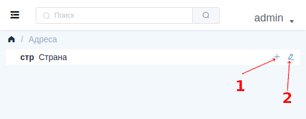
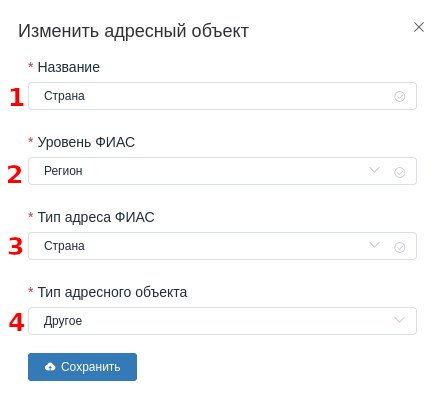

## Адресная система

Содержит информацию об адресах включений абонентов, местах установки оборудования, прописок в паспортах, нахождении офисов ЮР лиц, и.т.д.

С самого начала, когда ещё нет никаких данных, у вас уже есть созданная страна. Под ней можно создавать округи, регионы, республики. Под ними города, районы, и.т.д. в иерархическом порядке, вплоть до домов, квартир, комнат.

Для того, чтобы создать новый адресный объект нажмите на значёк "**+**" на против объекта, под которым хотите создать новый. Ни скриншоте обозначено №1.
Для редактирования аресного объекта рядом с "**+**" есть кнопка редактирования, на скриншоте обозначено №2.

Форма Адресного объекта выглядит так:

Поля со звёздочкой обязательны для заполнения. Т.е. тут все поля обязательны.

1. Название - Текстовое название адресного объекта.
2. Уровень [ФИАС](https://fias.nalog.ru/FiasInfo). Описание структуры государственной адресной системы пожно почитать на официальном сайте в разделе [Описание форматов выгрузки](https://fias.nalog.ru/Updates).
3. Тип адреса [ФИАС](https://fias.nalog.ru/FiasInfo): О том что это так же читать на [офф. сайте](https://fias.nalog.ru/Updates).
4. Тип адресного объекта: Определяет тип для внутреннего функционала системы. Имеет такие значения:
  4.1. Не задано: Когда тип не выбран.
  4.2. Населённый пункт: Адресные объекты, отмеченные данным пунктом будут отображаться в списке населённых пунктов абонентов, оборудования, и.т.д. Например, чтоб зайти в учётную запись абонента вы сначала откроете список населённых пунктов, зайдёте в какой-то, и уже внутри увидите список абонентов из этого населённого пункта.
  4.3. Улица: По объектам, отмеченным как улица можно фильтровать списки абонентов, оборудования, и.т.д. по указанному в их учётной записи адресу.
  4.4. Дом: Под домом тут имеется ввиду квартиры, комнаты, подъезды, и.т.д. всё, что ниже улицы.
  4.5. Номер офиса: учавстует в выгрузках СОРМ.
  4.6. Здание: учавстует в выгрузках СОРМ.
  4.7. Корпус: учавстует в выгрузках СОРМ.
  4.8. Другое: Выбранный, но не подходящий под существующие типы адресов тип адресного объекта.
