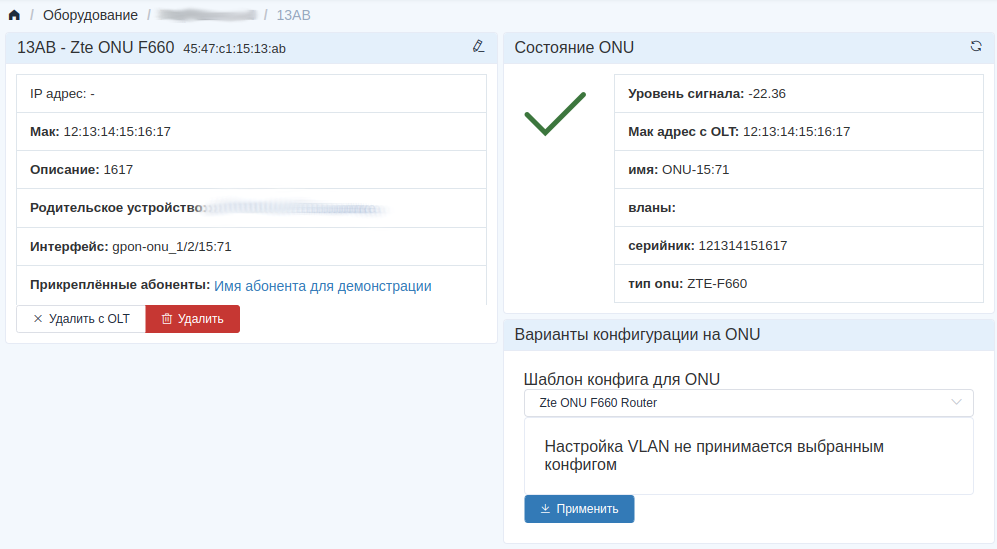

## Устройства(раздел "Оборудование")

> Предупреждение:
Если сразу открыть список оборудования, то вы увидите пустой список, и нельзя ничего добавить. Это список населённых пунктов. Для того чтобы добавлять оборудование, создайте населённый пункт в [адресах](addresses.md).

#### Добавление нового устройства.

Открыв список оборудования, можно увидеть список созданных устройств, или создать новое.
Форма создания нового устройства выглядит примерно так, как на скрине ниже:

Большинство полей, надеюсь, не нужно пояснять. Но некоторые всё же поясню.

**SNMP Community** — Это community для опроса устройств по [SNMP](https://ru.wikipedia.org/wiki/SNMP).
Если он не выставлен сразу, то его можно узнать у вашего системного администратора, того, кто настраивает оборудование. Если вы не используйте snmp, то можно заполнять поле значением "public", это классическое значение для snmp community.

**Группа** — Это та группа, в которой устройство будет доступно при его поиске для добавления, например, в учётную запись абонента. Или при оповещениях сотрудников о событиях в системе.

**Родительское устройство**. Тут указывается устройство, к которому подключено текущее устройство. Грубо говоря это можно представить как ветка, на которой держится лист(текущее устройство) в древовидной схеме сети. Направление имеется ввиду от глобальной сети к абоненту. т.е. ваши маршрутизаторы находятся ближе к корню, а абоненты это листы. С помощью этого поля можно рисовать древовидную логическую схему сети.
Такую схему планирую внедрить.

**Доп. инфо для snmp**. Это вспомогательное поле для хранения некоторых значений для опроса по snmp. Чаще всего заполяется системным администратором, или автоматическими скриптами. Доступно для редактирования вручную.

**Оповещать при событиях мониторинга**. Если эта галка установлена, то при событиях из системы мониторинга об этом будет оповещение всем ответственным за это оборудование сотруникам.

#### Типы оборудования
Все устройства в системе поделены на 2 больших семейства, это коммутаторы
с маршрутизаторами, и [PON](https://ru.wikipedia.org/wiki/PON).

Если попробовать открыть устройство, то система попробует опросить его по snmp на предмет текущего состояния, и отобразит страницу с устройством с видом, зависящим от типа устройства. Например, если открыть коммутатор, то мы увидим примерно такую картину:

А если это будет PON ONU(ONT) то картина будет такой:

Страница с PON GPON OLT, на примере ZTE C320, будет выглядеть примерно так:

Поддерживаемые типы оборудования:
———————————
* [Dlink DGS-1100-10/ME](https://dlink.ru/ru/products/1/1976.html)
* [Dlink DGS-3120-24SC](https://dlink.ru/ru/products/1/1365.html)
* [Dlink DGS-1100-06/ME](https://dlink.ru/ru/products/1/2048.html)
* [Dlink DGS-3627G](https://dlink.ru/ru/products/1/658.html)
* [Eltex MES](https://eltex-co.ru/catalog/aggregation/)
* [Huawei S2300 series](https://support.huawei.com/enterprise/en/switches/s2300-pid-16561)
* [Huawei S5300 LI AC](http://huawei-russia.ru/huawei-switches/huawei-switch-s5300-series/ls-s5306tp-li-ac-huawei-quidway-s5300-switch)
* [BDCOM P3310C](../assets/bdcom_p3310c.png)
* [EPON ONU Fora](../assets/onu-fora-na-1001d.jpg)
* [OLT ZTE C320](../assets/zte_c320.jpeg)
* [GPON ONU ZTE F660](../assets/zte_f660.jpg)
* [GPON ONU ZTE F601](../assets/zte-f601-gpon-onu.jpg)

###### Работа с устройствами PON OLT

После добавления в билинг OLT, можно добавлять onu прямо со страницы OLT. В случае ZTE снизу будет таблица *Незарегистрированные юниты*, и там кнопка добавления устройства в систему. **ВАЖНО**: в билинге не может существовать 2 устройства с одинаковым MAC адресом.

В случае с EPON OLT всё то же самое, только страница будет выглядеть чуть по другому.

###### Работа с устройствами PON ONU(ONT)

Добавление устройства в систему заключается в заполнении большинства полей формы этого устройства. Далее можно просматривать информацию о них и регистрировать некоторые onu на olt.

Например, устройства onu ZTE после добавления в билинг нужно ещё зарегистрировать на OLT. Для этого есть блок **Варианты конфигурации на ONU**. Тут можно выбрать тип конфигурации, и дополнительные параметры этой конфигурации. Сейчас для zte доступны несколько конфигураций:

**ZTE ONU Router** и **ZTE ONU Bridge**. Так как эти клиентские юниты могут работать как в режиме роутера так и просто свича, то и появился данный функционал.

Для обычных абонентов, в большинстве случаев, подходит "ZTE ONU Router". Это как домашний wifi роутер, только со встроенной onu.

Для некоторых особых случаев можно выключить на onu dhcp, nat, и всё что делает её роутером, и прокинуть через неё VLAN. Но эта информация больше актуальна для системного администратора, потому и освещена более детально в [соответствующем разделе](../administrator_instructions/pon-onu-zte-config.md).