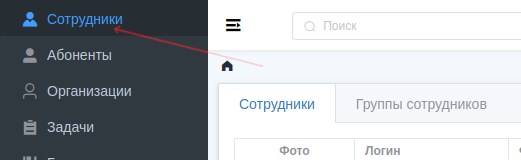
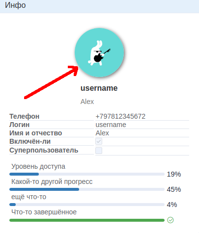
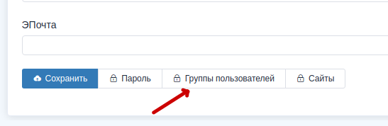
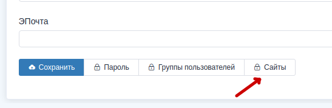

## Раздел учётных записей сотрудников

Раздел учётных записей находится в левом меню, называется "Сотрудники":

Учётные записи сотрудников далее буду называть **профилями**.

#### Создание нового профиля

Поля, отмеченные звёздочкой (*), обязательны к заполнению.
Создавать и редактировать профили кроме своей может только суперпользователь.

> Суперпользователь - Это профиль, имеющий <u>все</u> права, кроме того имеет некоторый дополнительный административный функционал.

После создания профиля можно изменить аватар. Но имейте ввиду, что изменять можно только <u>свой</u> аватар, даже если вы суперпользователь.
Для того, чтобы изменить его, нажмите на изображение аватара как на скрине ниже.

#### Функциональные кнопки на вкладке *Изменить*

"Сохранить" и "Пароль" доступны суперпользователю или владельцу учётной записи. "Группы пользователей" и "Сайты", к этим кнопкам, имеет доступ только суперпользователь.

Кнопка **Группы пользователей** изменяет участие профиля в группах профилей. **Группы профилей** это набор [прав доступа](rights.md).
Можно один раз настроить права доступа для разных ситуаций, а потом добавлять или удалять оттуда профили, и для них будут действовать те права, которые назначены в тех группах, в которых состоит профиль.

Кнопка **Сайты** управляет доступностью профиля на разных
[сайтах](sites.md).

Кратко: сайты это модуль из [Django](https://docs.djangoproject.com/en/3.1/ref/contrib/sites/), который позволяет отображать содержимое в зависимости от домена, с которого зашли на сайт.

#### Вкладка Ответственность за группы
На этой вкладке можно отметить те группы, к которым имеет отношение профиль. Например, при оповещении о событиях устройств профиль получит это оповещение, только если ответственен за эту группу. Или, при создании новой задачи по абоненту, в поле "*Исполнители*" профиль будет добавлен автоматически.

#### Вкладка Права на классы действий
Подробнее про работу прав читайте в разделе о [правах доступа](rights.md). Если кратко, то тут можно выбрать для профиля классовые права, которые будут ограничивать доступ по принципу: можно смотреть абонента, можно изменять абонента, и.т.д. Чтобы управлять доступом к конкретным объектом нужно настроить "*Объектные права*".