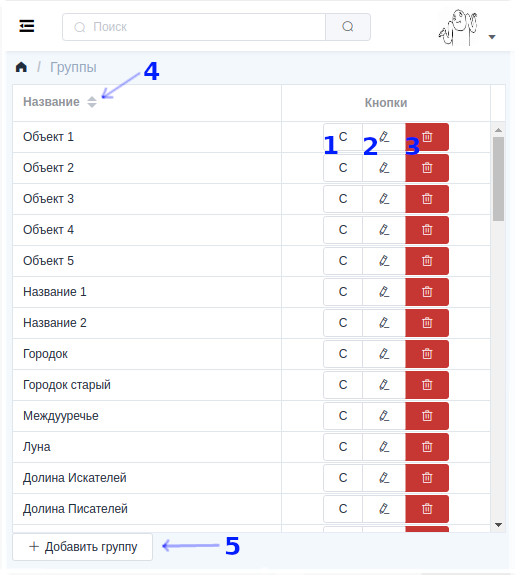

Как устроены таблицы
=====================

Под таблицами имеются в виду различные списки объектов. Это могут быть как абоненты, оборудование из группы, список задач, и.т.д.
Выглядят они примерно так: 

В некоторых таблицах, для учётных записей суперпользователя есть несколько кнопок, позволяющих настраивать доступность элементов для [сайтов](sites.md). Это номера 1, 2, 3.

1. Это кнопка управления правами. В выпадающем списке можно выбрать
для какой группы назначаются права, а снизу непосредственно права, которые
назначаются на объект, на против которого была нажата эта кнопка.
<!-- 1. Это кнопка управления доступностью на сайтах.
Там, где проставлены галки, на тех сайтах будет доступен
объект на против которого была нажата данная кнопка. -->

2 и 3 Это кнопки редактирования и удаления объекта.

4. Это описание столбца. Если справа от описания есть стрелочки то его можно сортировать, нажимая на это название.

5. С помощью этой кнопки можно вызвать диалог добавления нового элемента. Конкретно на этом скрине кнопка добавляет новую [группу](groups.md).